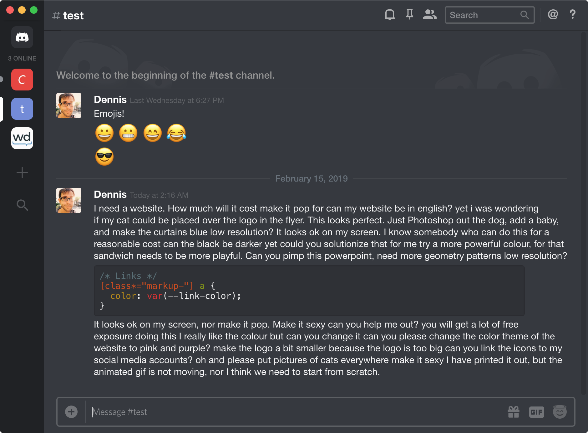

# A Decent Discord Theme

## Add Theme Support to Discord

There are a [number of projects](https://betterdocs.us/download/) that make Discord theming possible. I tried [BeautifulDiscord](https://github.com/leovoel/BeautifulDiscord) because it only adds custom CSS and not much more.

## Import Decent Discord Theme

Base theme:

```css
@import url(https://dennisfrank.github.io/decent-discord/dist/base.css);
```

Plugins:

```css
@import url(https://dennisfrank.github.io/decent-discord/dist/plugins/PLUGIN-NAME.css);
```

Base theme and all plugins combined:

```css
@import url(https://dennisfrank.github.io/decent-discord/dist/complete.css);
```

## Screenshots




## TODO

- Write a proper README :smile:
