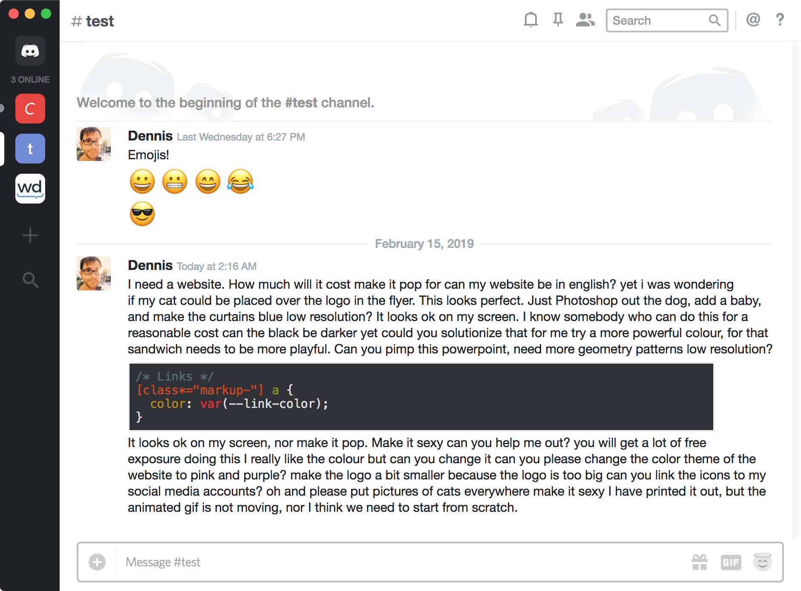
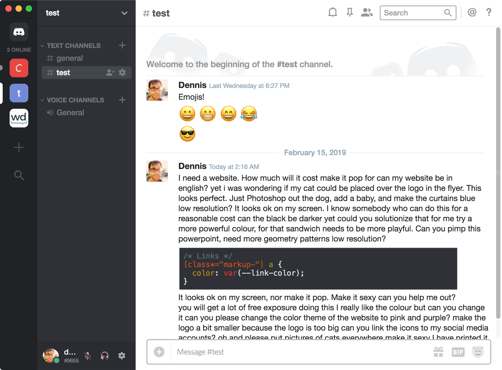

# A Decent Discord Theme

## Import the Theme

Base theme:

```css
@import url(https://dennisfrank.github.io/decent-discord/dist/base.css);
```

Plugins:

```css
@import url(https://dennisfrank.github.io/decent-discord/dist/plugins/PLUGIN-NAME.css);
```

Base theme and all plugins combined:

```css
@import url(https://dennisfrank.github.io/decent-discord/dist/complete.css);
```

## Screenshots






## TODO

- Write a proper README :smile:
